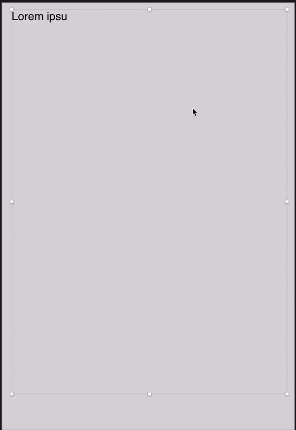

# TextCreator
A Sketch plugin to generate text characters within certain limit count taking input from user. 

## Install the plugin  
1. Click on code button in green
2. Download ZIP
3. Extract the contents of this repository. 
4. Then double-click the `TextCreator.sketchplugin` bundle to install the plugin. 

## Usage
Using the plugin is easy:

1. Shortcut `command + shift + i` or
2. Select TextCreator from plugin dropdown

## Demo

